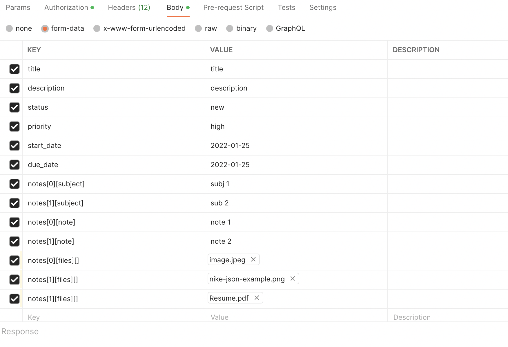
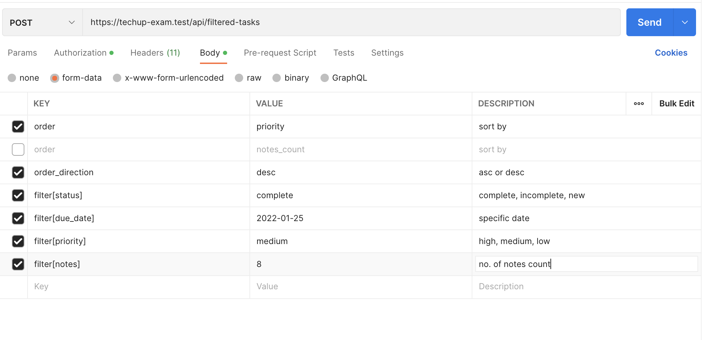

## Installation

- `git clone https://github.com/bhaumikpandhi/laravel-practical.git`
- `cd laravel-practical`
- `composer install`
- `cp .env.example .env`

### After project installation is completed, please add DB details in `.env` file

```
DB_CONNECTION=mysql
DB_HOST=
DB_PORT=3306
DB_DATABASE=
DB_USERNAME=
DB_PASSWORD=
```

We also need to populate `APP_URL` variable of `.env` that is used to see uploaded images publicly.

e.g
`APP_URL=http://laravel-practical.test`

### After DB details are set, we can create DB tables & dummy data using below command

`php artisan migrate --seed`

### Once we have tables, we need to set Laravel passport, via two commands

- `php artisan passport:keys`
- `php artisan passport:client --personal`


### Login Credentials

Email | Password| Access Allowed
--- | --- | --- 
authorised@gmail.com | password | true
unauthorised@gmail.com | password | false


----------------

## API details

### login

Its really simple API, accepting email and password. On successful login it returns user details with `authorization token`. That token is automatically set in postman `environment`

### register

It is also really simple API, accepting name, email and password. On successful login it returns user details with `authorization token`. That token is automatically set in postman `environment`

### create task

We're using single request to create 
- task
- note
- note files

Please take reference of attached screenshot to get idea about each field used.



If we only want to create task without note & files then it can be done using same API `(those details are optional)`

### advance task list (with filters)

Please take reference of attached screenshot to get idea about each field. FYI, each of below fields are optional. If we pass no fields then all tasks will be returned

Field | possible values | Usage
--- | --- | --- 
order | priority / notes_count | To sort tasks via priority or no. of notes
order_direction | desc / asc | To sort in specific direction `[A-Z or Z-A]`
filter[status] | complete / incomplete / new | To filter based on specific status
filter[due_date] | any date in `Y-m-d` format | To filter based on due date
filter[priority] | high / medium / low | To filter based on priority
filter[notes] | any integer number | To filter based on notes count available in specific task.




